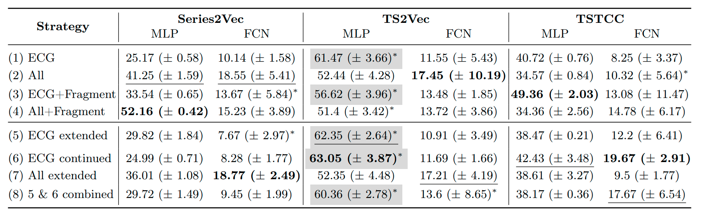
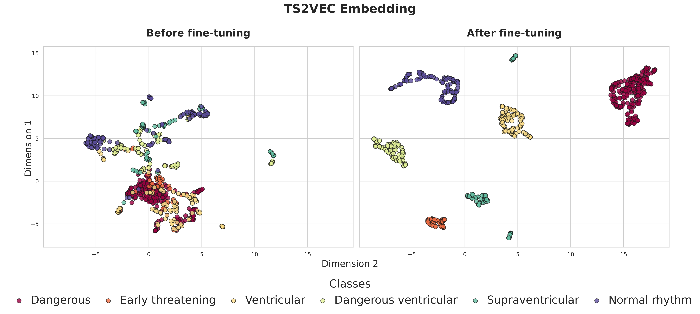
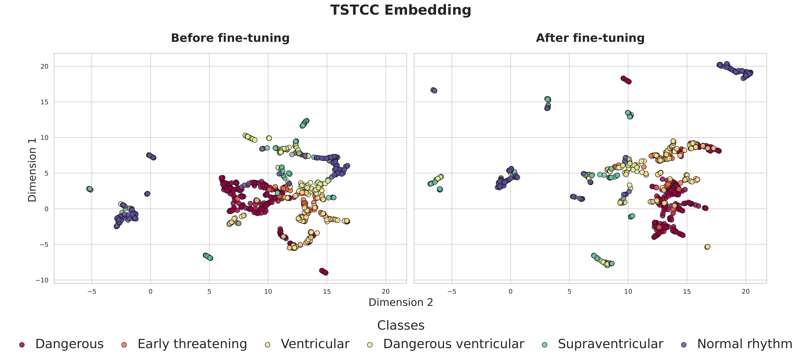

# Exploring Data-Oriented Strategies for Training ECG Self-Supervised Models
---
Pytorch official implementation for Exploring Data-Oriented Strategies for Training ECG Self-Supervised Models

This work investigates several data-oriented strategies for pretraining self-supervised learning models in a cross-dataset setting to address a challenging ECG classification task. We introduce a data-driven regularization approach that perturbs the pretrained model using signals from multiple domains. We evaluated three well-established SSL models as backbones with different classification architectures across over 100 experiments, achieving superior performance to traditional SSL methods and a state-of-the-art supervised deep learning classification model.


## Setup
We provide a conda environment file: `environment.yml`. To create the environment, run:

```bash
conda env create -f environment.yml # create the conda environment
conda activate ecg-ssl # activate the environment
pip install -e . # install the packag`
```

**Project Structure**
```
.
├── anaylsis.ipynb
├── Configs
├── Dataset
├── finetuning.py
├── main_supervised.py
├── mine_utils.py
├── models
├── README.md
├── requirements.yml
├── Results
├── run_S2V_and_downstream.sh
├── run.sh
├── run_supervised_models.sh
├── ssl_pretraining.py
├── summary
├── utils
└── wandb
```
## Results


### Embeddings





# Cite
Comming soon!
